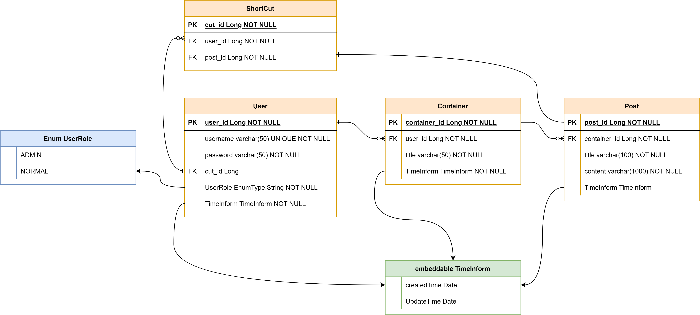

# **Notebook_API**
개인 프로젝트  

 

# 개요
- JPA를 활용한 REST API 프로젝트.
- 학습을 위해 EntityManager를 사용하는 Hibernate JPA로 작성함.

 

# 목표
- [이전 프로젝트](http://faraway.iptime.org:131/login)를 API로 구현 및 개선
- H2 DB에서 개발한 것을 MySQL로 환경바꾸기
- API 스펙 작성

# 사용 기술
> ## BackEnd
- JDK 11
- Spring Boot v2.7.10
- Spring Data JPA
- Hibernate JPA
- Lombok

> ## Database
- H2 DB
- MySQL

> ## FrontEnd
- Swagger UI

> ## IDE
- IntelliJ IDEA

# 구조도
> ## 1. ERD

- 각 사용자의 데이터의 무결성을 지키고자 User와 Container가 1:N, Container와 Post가 또 1:N 관계가 맺어짐  

- User와 연결된 ShortCut 테이블은 즐겨찾기 기능 같은 것을 생각해서 생성  

- User, Container, Post 에 공통된 생성 시간과 수정 시간은 JPA의 embedded 타입으로 참조하게 함

- 사용자의 권한을 구분하기 위해 Enum 타입 사용

- 작성중...