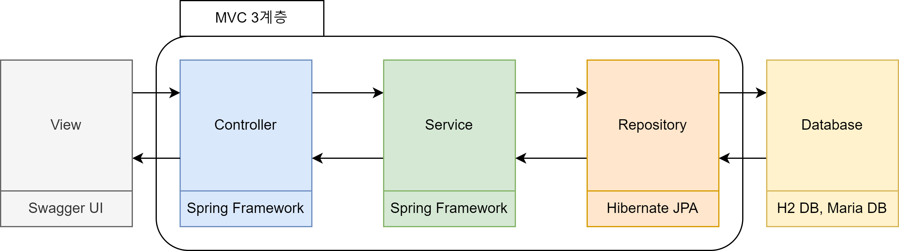
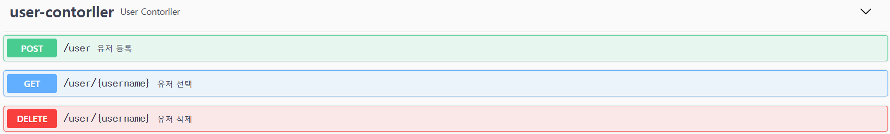
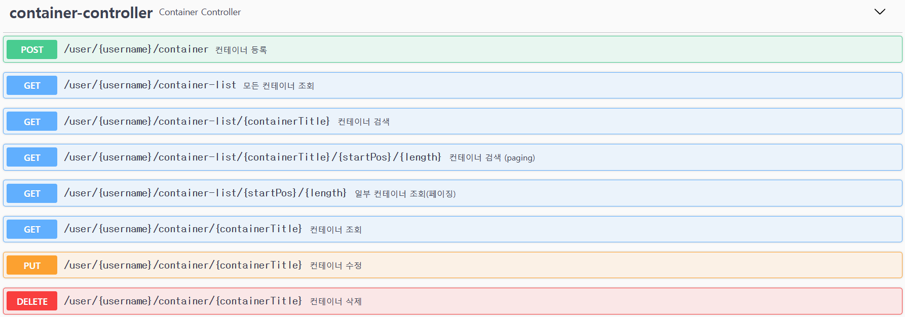
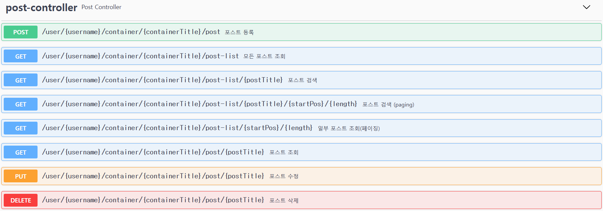
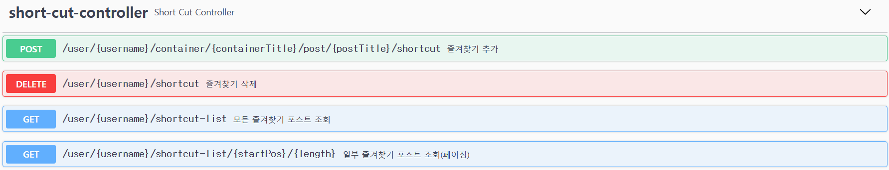

# **Notebook_API**
개인 프로젝트  

<br>

# 개요
- JPA를 활용한 REST API 프로젝트.
- 학습을 위해 EntityManager를 사용하는 Hibernate JPA로 작성함.

<br>

# 목표
- 계층관계를 나타내는 REST API 작성
- API 스펙 작성

# 사용 기술
> ## BackEnd
- JDK 11
- Spring Boot v2.7.10
- Spring Data JPA
- Hibernate JPA
- Lombok

> ## Database
- H2 DB
- Maria DB

> ## FrontEnd
- Swagger UI

> ## IDE
- IntelliJ IDEA

# 구조도
> ## 1. ERD


- 각 사용자의 데이터의 무결성을 지키고자 User와 Container가 1:N, Container와 Post가 또 1:N 관계가 맺어짐  

- User와 연결된 ShortCut 테이블은 즐겨찾기 기능 같은 것을 생각해서 생성  

- User, Container, Post 에 공통된 생성 시간과 수정 시간은 JPA의 embedded 타입으로 참조하게 함

- 사용자의 권한을 구분하기 위해 Enum 타입 사용

> ## 2. MVC 계층


- API 도큐먼트 자동화를 위해 Swagger UI를 사용함

- URL 라우팅과 비즈니스 로직을 분리하기 위해 Controller와 Service로 계층을 나눔

- DB 접근으로 Hibernate JPA를 사용함

# API 스펙


<details>
<summary>상세 내용 확인</summary>
<div markdown="1">

### 1.  POST /user 
- 유저 등록  
  - 해당 유저를 데이터베이스에 등록한다.

<br>

- RequestBody
```json
{
  "username": "faraway",
  "password": "asdf"
}
```
- Parameter
  - username : 유저 이름
  - password : 비밀번호

<br>

- ResponseBody
  - 성공한다면 다음 리스폰스 바디가 반환된다.
```json
{
  "object": {
    "isRegister": true
  }
}
```
- Parameter
  - isRegister : 성공하였다면 true를 반환한다.

<br>

### 2. GET /user/{username}
- 유저 선택
  - 해당 유저의 정보를 불러온다.
<br>

- PathVariable
  - {username} : 데이터베이스에 등록된 유저 이름

- ResponseBody

```json
{
  "object": {
    "timeInform": {
      "createdTime": 1682658673777,
      "updatedTime": 1682658673777
    },
    "userRole": "NORMAL",
    "container": [
      {
        "containerId": 1,
        "timeInform": {
          "createdTime": 1682658673837,
          "updatedTime": 1682658673837
        },
        "title": "새 컨테이너",
        "posts": [
          {
            "postId": 1,
            "timeInform": {
              "createdTime": 1682658673864,
              "updatedTime": 1682658673864
            },
            "title": "새 포스트 입니다.",
            "content": "포스트 내용입니다."
          },
          {
            "postId": 2,
            "timeInform": {
              "createdTime": 1682658673870,
              "updatedTime": 1682658673870
            },
            "title": "새 포스트 입니다.2",
            "content": "포스트 내용입니다.2"
          }
        ]
      },
      {
        "containerId": 2,
        "timeInform": {
          "createdTime": 1682658673845,
          "updatedTime": 1682658673845
        },
        "title": "다른 컨테이너",
        "posts": [
          {
            "postId": 3,
            "timeInform": {
              "createdTime": 1682658673875,
              "updatedTime": 1682658673875
            },
            "title": "새 포스트 입니다.3",
            "content": "포스트 내용입니다.3"
          }
        ]
      }
    ],
    "username": "faraway"
  }
}
```
- Parameter
  - timeInform : 객체의 시간관련 정보를 나타낸다
    - createdTime : 생성 시간
    - updatedTime : 수정 시간
  - userRole : 유저 권한
  - container : 유저에게 속한 컨테이너 목록
    - containerId : 컨테이너 인덱스
    - title : 컨테이너 이름
    - posts : 컨테이너에 속한 포스트 목록
      - postId : 포스트 인덱스
      - title : 포스트 제목
      - content : 포스트 내용
  - username : 유저 이름

<br>

### 3. DELETE /user/{username}
- 유저 삭제
  - 해당 유저를 데이터베이스에서 삭제한다.

- PathVariable
  - {username} : 삭제할 유저 이름

- ResponseBody
```json
{
  "object": {
    "isDeleted": true
  }
}
```
- isDeleted : 삭제에 성공한다면 true를 반환한다.


</details>
<br>



<details>
<summary>상세 내용 확인</summary>
<div markdown="1">

<br>

### 1. POST /user/{username}/container
- 컨테이너 등록
  - 컨테이너를 데이터베이스에 등록한다.

- PathVariable
  - {username} : 유저 이름

- RequestBody
```json
{
  "containerTitle": "아무거나"
}
```
- Parameter
  - containerTitle : 등록할 컨테이너 이름

- ResponseBody

```json
{
  "object": {
    "isCreated": true
  }
}
```
- Parameter
  - isCreated : 등록되었다면 true를 반환한다.

<br>

### 2. GET /user/{username}/container/{containerTitle}
- 컨테이너 조회
  - 해당 컨테이너를 조회한다.

- PathVariable
  - {username} : 유저 이름
  - {containerTitle} : 등록된 컨테이너 이름

- ResponseBody

```json
{
  "object": {
    "containerId": 1,
    "timeInform": {
      "createdTime": 1682660344788,
      "updatedTime": 1682660568303
    },
    "title": "또 다른 컨테이너",
    "posts": [
      {
        "postId": 1,
        "timeInform": {
          "createdTime": 1682660344819,
          "updatedTime": 1682660344819
        },
        "title": "새 포스트 입니다.",
        "content": "포스트 내용입니다."
      },
      {
        "postId": 2,
        "timeInform": {
          "createdTime": 1682660344825,
          "updatedTime": 1682660344825
        },
        "title": "새 포스트 입니다.2",
        "content": "포스트 내용입니다.2"
      }
    ]
  }
}
```
- Parameter
  - containerId : 컨테이너 인덱스
  - timeInform : 시간 정보
    - createdTime : 생성 시간
    - updatedTime : 수정 시간
  - title : 컨테이너 제목
  - posts : 컨테이너에 속한 포스트 목록
    - postId : 포스트 인덱스
    - title : 포스트 제목
    - content : 포스트 내용

<br>

### 3. PUT /user/{username}/container/{containerTitle}

- 컨테이너 수정
  - 해당 컨테이너를 수정한다.

- PathVariable
  - {username} : 유저 이름
  - {containerTitle} : 등록된 컨테이너 이름

- RequestBody
```json
{
  "containerTitle": "또 다른 컨테이너"
}
```
- Parameter
  - containerTitle : 수정 후 컨테이너 이름

- ResponseBody

```json
{
  "object": {
    "isUpdated": true
  }
}
```
- Parameter
  - isUpdated : 수정이 성공하였으면 true를 반환한다.

### 4. DELETE /user/{username}/container/{containerTitle}

- 컨테이너 삭제
  - 해당 컨테이너를 삭제한다.

- PathVariable
  - {username} : 유저 이름
  - {containerTitle} : 등록된 컨테이너 이름

- ResponseBody

```json
{
  "object": {
    "isDeleted": true
  }
}
```
- Parameter
  - isDeleted : 삭제가 성공하였으면 true를 반환한다.

### 5. GET /user​/{username}​/container-list

- 모든 컨테이너 조회
  - 해당 유저의 모든 컨테이너 목록을 조회한다.

- PathVariable
  - {username} : 유저 이름

- ResponseBody

```json
{
  "object": [
    {
      "containerId": 1,
      "timeInform": {
        "createdTime": 1682661241329,
        "updatedTime": 1682661241329
      },
      "title": "새 컨테이너",
      "posts": [
        {
          "postId": 1,
          "timeInform": {
            "createdTime": 1682661241355,
            "updatedTime": 1682661241355
          },
          "title": "새 포스트 입니다.",
          "content": "포스트 내용입니다."
        },
        {
          "postId": 2,
          "timeInform": {
            "createdTime": 1682661241361,
            "updatedTime": 1682661241361
          },
          "title": "새 포스트 입니다.2",
          "content": "포스트 내용입니다.2"
        }
      ]
    },
    {
      "containerId": 2,
      "timeInform": {
        "createdTime": 1682661241337,
        "updatedTime": 1682661241337
      },
      "title": "다른 컨테이너",
      "posts": [
        {
          "postId": 3,
          "timeInform": {
            "createdTime": 1682661241367,
            "updatedTime": 1682661241367
          },
          "title": "새 포스트 입니다.3",
          "content": "포스트 내용입니다.3"
        }
      ]
    }
  ]
}
```
- Parameter
  - containerId : 컨테이너 인덱스
  - timeInform : 시간 정보
    - createdTime : 생성 시간
    - updatedTime : 수정 시간
  - title : 컨테이너 제목
  - posts : 컨테이너에 속한 포스트 목록
    - postId : 포스트 인덱스
    - title : 포스트 제목
    - content : 포스트 내용

### 6. GET /user​/{username}​/container-list/{startPos}/{length}

- 컨테이너 조회(페이징)
  - 해당 유저의 컨테이너 목록 중 특정 범위를 조회한다.

- PathVariable
  - {username} : 유저 이름
  - {startPos} : 시작 인덱스
  - {length} : 시작 인덱스부터 컨테이너를 가져올 개수


- ResponseBody

```json
{
  "object": [
    {
      "containerId": 1,
      "timeInform": {
        "createdTime": 1682661241329,
        "updatedTime": 1682661241329
      },
      "title": "새 컨테이너",
      "posts": [
        {
          "postId": 1,
          "timeInform": {
            "createdTime": 1682661241355,
            "updatedTime": 1682661241355
          },
          "title": "새 포스트 입니다.",
          "content": "포스트 내용입니다."
        },
        {
          "postId": 2,
          "timeInform": {
            "createdTime": 1682661241361,
            "updatedTime": 1682661241361
          },
          "title": "새 포스트 입니다.2",
          "content": "포스트 내용입니다.2"
        }
      ]
    }
  ]
}
```
- Parameter
  - containerId : 컨테이너 인덱스
  - timeInform : 시간 정보
    - createdTime : 생성 시간
    - updatedTime : 수정 시간
  - title : 컨테이너 제목
  - posts : 컨테이너에 속한 포스트 목록
    - postId : 포스트 인덱스
    - title : 포스트 제목
    - content : 포스트 내용

### 7. GET /user​/{username}​/container-list/{containerKeyword}
- 컨테이너 수정
  - 해당 컨테이너를 수정한다.

- PathVariable
  - {username} : 유저 이름
  - {containerKeyword} : 검색할 컨테이너 제목 키워드

- ResponseBody

```json
{
  "object": [
    {
      "containerId": 2,
      "timeInform": {
        "createdTime": 1682661241337,
        "updatedTime": 1682661241337
      },
      "title": "다른 컨테이너",
      "posts": [
        {
          "postId": 3,
          "timeInform": {
            "createdTime": 1682661241367,
            "updatedTime": 1682661241367
          },
          "title": "새 포스트 입니다.3",
          "content": "포스트 내용입니다.3"
        }
      ]
    }
  ]
}
```
- Parameter
  - containerId : 컨테이너 인덱스
  - timeInform : 시간 정보
    - createdTime : 생성 시간
    - updatedTime : 수정 시간
  - title : 컨테이너 제목
  - posts : 컨테이너에 속한 포스트 목록
    - postId : 포스트 인덱스
    - title : 포스트 제목
    - content : 포스트 내용


### 8. GET /user​/{username}​/container-list/{containerKeyword}/{startPos}/{length}

- 컨테이너 검색 (paging)
  - 해당 유저의 컨테이너에서 제목에 키워드가 들어간 컨테이너 중 특정 범위를 조회한다.

- PathVariable
  - {username} : 유저 이름
  - {startPos} : 시작 인덱스
  - {containerKeyword} : 검색할 컨테이너 제목 키워드
  - {length} : 시작 인덱스부터 컨테이너를 가져올 개수

- ResponseBody

```json
{
  "object": [
    {
      "containerId": 2,
      "timeInform": {
        "createdTime": 1682661241337,
        "updatedTime": 1682661241337
      },
      "title": "다른 컨테이너",
      "posts": [
        {
          "postId": 3,
          "timeInform": {
            "createdTime": 1682661241367,
            "updatedTime": 1682661241367
          },
          "title": "새 포스트 입니다.3",
          "content": "포스트 내용입니다.3"
        }
      ]
    }
  ]
}
```
- Parameter
  - containerId : 컨테이너 인덱스
  - timeInform : 시간 정보
    - createdTime : 생성 시간
    - updatedTime : 수정 시간
  - title : 컨테이너 제목
  - posts : 컨테이너에 속한 포스트 목록
    - postId : 포스트 인덱스
    - title : 포스트 제목
    - content : 포스트 내용


</details>
<br>



<details>
<summary>상세 내용 확인</summary>
<div markdown="1">

### 1. POST ​/user​/{username}​/container​/{containerTitle}​/post
- 포스트 등록
  - 포스트를 등록한다.

- PathVariable
  - {username} : 유저 이름
  - {containerTitle} : 등록된 컨테이너 이름

- RequestBody
```json
{
  "postTitle": "새 포스트",
  "postContent": "새 내용"
}
```
- Parameter
  - postTitle : 등록할 포스트 이름
  - postContent : 등록할 포스트 내용

- ResponseBody

```json
	
Response body
Download
{
  "object": {
    "isInserted": true
  }
}
```
- Parameter
  - isInserted : 등록이 성공하였으면 true를 반환한다.

<br>

### 2. GET ​/user​/{username}​/container​/{containerTitle}​/post​/{postTitle}
- 포스트 조회
  - 해당 포스트를 조회한다.

- PathVariable
  - {username} : 유저 이름
  - {containerTitle} : 등록된 컨테이너 이름
  - {postTitle} : 등록된 포스트 이름

- ResponseBody

```json
{
  "object": {
    "postId": 5,
    "timeInform": {
      "createdTime": 1682662770404,
      "updatedTime": 1682662770404
    },
    "title": "새 포스트",
    "content": "새 내용"
  }
}
```
- Parameter
  - postId : 포스트 인덱스
  - timeInform : 시간 정보
    - createdTime : 생성 시간
    - updatedTime : 수정 시간
  - title : 포스트 제목
  - content : 포스트 내용

### 3. PUT ​/user​/{username}​/container​/{containerTitle}​/post​/{postTitle}

- 포스트 수정
  - 해당 포스트를 수정한다.

- PathVariable
  - {username} : 유저 이름
  - {containerTitle} : 등록된 컨테이너 이름
  - {postTitle} : 등록된 포스트 이름

- RequestBody
```json
{
  "postTitle": "수정 포스트",
  "postContent": "수정된 내용"
}
```
- Parameter
  - postTitle : 수정 후 포스트 이름
  - postTitle : 수정 후 포스트 내용

- ResponseBody

```json
{
  "object": {
    "isUpdated": true
  }
}
```
- Parameter
  - isUpdated : 수정이 성공하였으면 true를 반환한다.

### 4. DELETE ​/user​/{username}​/container​/{containerTitle}​/post​/{postTitle}

- 포스트 삭제
  - 해당 포스트를 수정한다.

- PathVariable
  - {username} : 유저 이름
  - {containerTitle} : 등록된 컨테이너 이름
  - {postTitle} : 등록된 포스트 이름


- ResponseBody

```json
{
  "object": {
    "isDeleted": true
  }
}
```
- Parameter
  - isDeleted : 삭제에 성공하였으면 true를 반환한다.


### 5. GET /user/{username}/container/{containerTitle}/post-list
- 모든 포스트 조회
  - 해당 컨테이너의 모든 포스트 목록을 조회한다.

- PathVariable
  - {username} : 유저 이름
  - {containerTitle} : 컨테이너 이름


- ResponseBody

```json
{
  "object": [
    {
      "postId": 1,
      "timeInform": {
        "createdTime": 1682661241355,
        "updatedTime": 1682661241355
      },
      "title": "새 포스트 입니다.",
      "content": "포스트 내용입니다."
    },
    {
      "postId": 2,
      "timeInform": {
        "createdTime": 1682661241361,
        "updatedTime": 1682661241361
      },
      "title": "새 포스트 입니다.2",
      "content": "포스트 내용입니다.2"
    },
    {
      "postId": 4,
      "timeInform": {
        "createdTime": 1682662480868,
        "updatedTime": 1682662480868
      },
      "title": "새 내용",
      "content": "새 포스트"
    },
    {
      "postId": 5,
      "timeInform": {
        "createdTime": 1682662770404,
        "updatedTime": 1682663142340
      },
      "title": "수정 포스트",
      "content": "수정된 내용"
    }
  ]
}
```

- Parameter
  - postId : 포스트 인덱스
  - timeInform : 시간 정보
    - createdTime : 생성 시간
    - updatedTime : 수정 시간
  - title : 포스트 제목
  - content : 포스트 내용

### 6. GET /user​/{username}​/container​/{containerTitle}​/post-list​/{startPos}​/{length}
- 모든 포스트 조회(페이징)
  - 해당 컨테이너의 포스트 목록 중 특정 범위를 조회한다.

- PathVariable
  - {username} : 유저 이름
  - {containerTitle} : 컨테이너 이름
  - {startPos} : 시작 포스트 인덱스
  - {length} : 시작 포스트 인덱스부터 가져올 포스트 개수


- ResponseBody

```json
{
  "object": [
    {
      "postId": 2,
      "timeInform": {
        "createdTime": 1682661241361,
        "updatedTime": 1682661241361
      },
      "title": "새 포스트 입니다.2",
      "content": "포스트 내용입니다.2"
    },
    {
      "postId": 4,
      "timeInform": {
        "createdTime": 1682662480868,
        "updatedTime": 1682662480868
      },
      "title": "새 내용",
      "content": "새 포스트"
    }
  ]
}
```

- Parameter
  - postId : 포스트 인덱스
  - timeInform : 시간 정보
    - createdTime : 생성 시간
    - updatedTime : 수정 시간
  - title : 포스트 제목
  - content : 포스트 내용

### 7. GET ​/user​/{username}​/container​/{containerTitle}​/post-list​/{postKeyword}

- 포스트 검색
  - 해당 유저의 컨테이너에서 제목에 키워드가 들어간 포스트를 조회한다.

- PathVariable
  - {username} : 유저 이름
  - {containerTitle} : 컨테이너 이름
  - {postKeyword} : 검색할 포스트 이름 키워드


- ResponseBody

```json
{
  "object": [
    {
      "postId": 4,
      "timeInform": {
        "createdTime": 1682662480868,
        "updatedTime": 1682662480868
      },
      "title": "새 내용",
      "content": "새 포스트"
    }
  ]
}
```

- Parameter
  - postId : 포스트 인덱스
  - timeInform : 시간 정보
    - createdTime : 생성 시간
    - updatedTime : 수정 시간
  - title : 포스트 제목
  - content : 포스트 내용

### 8. GET /user​/{username}​/container​/{containerTitle}​/post-list​/{postKeyword}​/{startPos}​/{length}

- 포스트 검색
  - 해당 유저의 컨테이너에서 제목에 키워드가 들어간 포스트를 조회한다.

- PathVariable
  - {username} : 유저 이름
  - {containerTitle} : 컨테이너 이름
  - {postKeyword} : 검색할 포스트 이름 키워드
  - {startPos} : 시작 포스트 인덱스
  - {length} : 시작 포스트 인덱스부터 가져올 포스트 개수


- ResponseBody

```json
{
  "object": [
    {
      "postId": 4,
      "timeInform": {
        "createdTime": 1682662480868,
        "updatedTime": 1682662480868
      },
      "title": "새 내용",
      "content": "새 포스트"
    }
  ]
}
```

- Parameter
  - postId : 포스트 인덱스
  - timeInform : 시간 정보
    - createdTime : 생성 시간
    - updatedTime : 수정 시간
  - title : 포스트 제목
  - content : 포스트 내용

</details>
<br>



<details>
<summary>상세 내용 확인</summary>
<div markdown="1">

### 1. POST ​/user​/{username}​/container​/{containerTitle}​/post​/{postTitle}​/shortcut
- 즐겨찾기 추가
  - 해당 포스트를 즐겨찾기 목록에서 추가한다.

- PathVariable
  - {username} : 유저 이름
  - {containerTitle} : 컨테이너 이름
  - {postTitle} : 포스트 이름

- ResponseBody

```json
{
  "object": {
    "isInserted": true
  }
}
```
- Parameter
  - isInserted : 추가에 성공하였으면 true를 반환한다.

### 2. GET /user​/{username}​/shortcut-list

- 모든 즐겨찾기 포스트 조회
  - 해당 유저의 모든 즐겨찾기한 포스트 목록을 조회한다.

- PathVariable
  - {username} : 유저 이름

- ResponseBody

```json
{
  "object": [
    {
      "id": 1,
      "post": {
        "postId": 1,
        "timeInform": {
          "createdTime": 1682661241355,
          "updatedTime": 1682661241355
        },
        "title": "새 포스트 입니다.",
        "content": "포스트 내용입니다."
      }
    }
  ]
}
```
- Parameter
  - postId : 포스트 인덱스
  - timeInform : 시간 정보
    - createdTime : 생성 시간
    - updatedTime : 수정 시간
  - title : 포스트 제목
  - content : 포스트 내용

### 3. GET /user/{username}/shortcut-list/{startPos}/{length}
- 모든 즐겨찾기 포스트 조회
  - 해당 유저의 모든 즐겨찾기한 포스트 목록을 조회한다.

- PathVariable
  - {username} : 유저 이름
  - {startPos} : 시작 인덱스
  - {length} : 시작 인덱스부터 가져올 포스트 개수

- ResponseBody

```json
{
  "object": [
    {
      "id": 1,
      "post": {
        "postId": 1,
        "timeInform": {
          "createdTime": 1682661241355,
          "updatedTime": 1682661241355
        },
        "title": "새 포스트 입니다.",
        "content": "포스트 내용입니다."
      }
    }
  ]
}
```
- Parameter
  - postId : 포스트 인덱스
  - timeInform : 시간 정보
    - createdTime : 생성 시간
    - updatedTime : 수정 시간
  - title : 포스트 제목
  - content : 포스트 내용


### 4. DELETE /user/{username}/shortcut
- 즐겨찾기 제거
  - 해당 포스트를 즐겨찾기 목록에서 제거한다.
  - 
- PathVariable
  - {username} : 유저 이름

- RequestBody
```json
{
  "shortCutId": 0
}
```
- Parameter
  - shortCutId : 삭제할 즐겨찾기 인덱스

- ResponseBody

```json
{
  "object": {
    "isDeleted": true
  }
}
```
- Parameter
  - isDeleted : 제거에 성공하였으면 true를 반환한다.

</details>
<br>

# 예외 처리

## 1. BindingResult
BindingResult와 MessageSource를 활용하여 Controller로 들어오는 RequestBody에 대한 Validation을 진행함

<details>
<summary>상세 내용 확인</summary>
<div markdown="1">
작성 중
</details>

## 2. ExceptionHandler
@RestControllerAdvice과 @ExeptionHandler를 활용한 예외 처리를 함
RuntimeException()을 상속하고 커스텀하여 Service계층에서의 예외를 처리하였음

<details>
<summary>상세 내용 확인</summary>
<div markdown="1">
작성 중
</details>

[상세 코드 확인](https://github.com/INGPlay/Spring_API_JPA_example/tree/master/practice/src/main/java/api/jpa/practice/exception)

# 한 것들
- DB 구성
- REST API 코드 작성
- JPA 코드 작성

# 하면서 깨달은 것

1. JPA Entity 작성 시 자주 Update 되는 컬럼을 모아 따로 Embeddable 같은 객체로 만들고 Entity에서 참조해야 더 사용하기 편하게 될 듯하다.

2. Response Body를 어떻게 줘야 더 좋을지에 대한 고민이 있다. 이거는 프론트 단에 대한 이해가 부족해서이지 않을까 생각한다.

3. API에서 인증방식으로 JWT를 많이 선택하는데, Spring에서는 그것을 Spring Security와 연동하는 방식을 취하는 방식이 많은 듯하다. 그래서 그것을 해보려고 했는데, 이해가 안된다. JWT 방식에서 인증하고 토큰을 발급하는데 여러 번의 통신이 이루어지는데, 이것을 코드로 봐도 이해를 잘 못하겠다. 그냥 코드를 가져다 쓸 수도 있겠지만, 보안에 관련된 만큼 이해가 중요하지 않을까 생각된다.
    - 일단 Spring Security 실행 단계에 대한 학습이 필요하지 않나 생각한다. 그 후에 JWT 인증을 다시 생각해본다.

4. ExceptionHandler를 사용하여 예외처리를 자동화할 수 있다. 이를 이용하여 하나하나 예외를 처리한 코드를 다 지워낼 수 있었다.

5. Spring MVC에서는 Thymeleaf에서 자동화된 것이라 간과한 것인데, API에서 BindingResult를 MessageSource와 연동하는 작업을 해줘야 message.properties를 쓸 수 있다.

# 추가로 학습해야할 거...
- 프론트 단에서 API를 받는 방식에 대한 이해
- Spring Security and JWT
- Spring Filter
- Spring Data JPA
- Query DSL